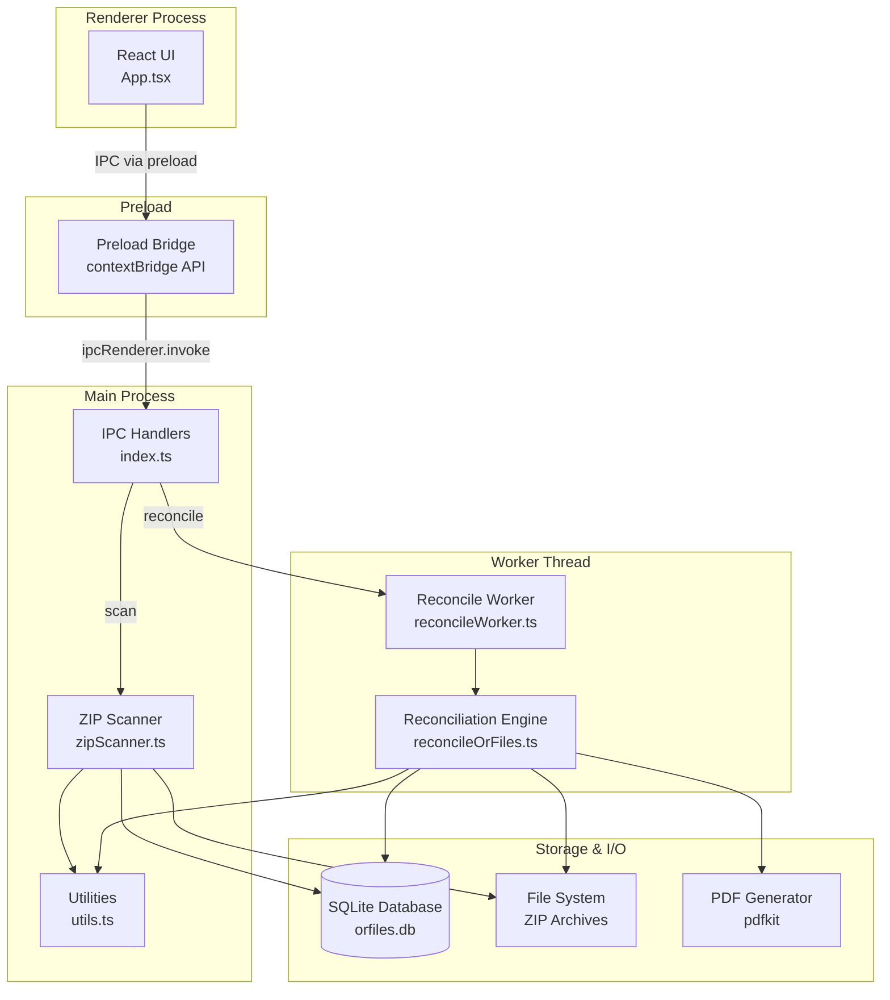

# BIR eJournal and Auditing Trail Generation System


A desktop application for scanning, reconciling, and generating auditing trails from BIR (Bureau of Internal Revenue) Official Receipt (OR) and Senior Citizen (SR) files. Built with Electron, React, and TypeScript.

---

## Table of Contents

- [Features](#features)
- [Installation](#installation)
  - [For End Users](#for-end-users)
  - [For Developers](#for-developers)
- [Usage Guide](#usage-guide)
  - [Workflow Overview](#workflow-overview)
  - [Input Fields](#input-fields)
  - [Understanding Results](#understanding-results)
- [Expected Input Folder Structure](#expected-input-folder-structure)
- [How It Works](#how-it-works)
  - [Phase 1: Scanning](#phase-1-scanning)
  - [Phase 2: Reconciliation](#phase-2-reconciliation)
  - [Phase 3: Output Generation](#phase-3-output-generation)
- [Architecture & Tech Stack](#architecture--tech-stack)
  - [System Architecture](#system-architecture)
  - [Tech Stack](#tech-stack)
- [Project Structure](#project-structure)
- [Development Guide](#development-guide)
  - [Available Scripts](#available-scripts)
  - [Building for Production](#building-for-production)
- [Troubleshooting / FAQ](#troubleshooting--faq)
  - [Common Errors](#common-errors)
  - [FAQ](#faq)
- [Changelog](#changelog)

---

## Features

- **Automated ZIP Scanning** — Recursively scans nested, password-protected ZIP archives containing OR/SR receipt files
- **SQLite-Powered Storage** — Stores extracted receipt metadata (amounts, payment types, dates) in a local database for fast querying
- **Intelligent Reconciliation** — Pairs high-value and low-value records using a configurable algorithm to reach a target amount
- **Receipt Body Swapping** — Replaces the body content of high-value receipts with low-value receipt bodies while preserving header/footer structure
- **Flexible Filtering** — Filter by date range (month/year), payment type (Cash, Non Cash, Sr Bill), and configurable value thresholds
- **PDF Generation** — Optionally converts output receipt files to formatted PDF documents
- **Batch Processing** — Handles entire branch folder hierarchies in a single operation using background worker threads
- **Non-Blocking UI** — Reconciliation runs in a dedicated worker thread, keeping the interface responsive
- **Windows Installer** — Ships as a one-click NSIS installer with desktop shortcut support

---

## Installation

### For End Users

1. Download the latest `bir-ejournal-1.0.0-setup.exe` installer from the releases page or your team's distribution channel
2. Run the installer — choose your installation directory when prompted
3. Launch **BIR eJournal and Auditing Trail Generation** from your desktop shortcut or Start Menu

**System Requirements:**
- Windows 10 or later (64-bit)
- At least 4 GB RAM recommended for large branch scans
- Sufficient disk space for output files (~2x the size of the source OR/SR files)

### For Developers

**Prerequisites:**
- [Node.js](https://nodejs.org/) v18 or later
- npm (included with Node.js)
- Git

**Setup:**

```bash
# Clone the repository
git clone <repository-url>
cd bir-ejournal

# Install dependencies (also triggers native module rebuild for better-sqlite3)
npm install

# Start in development mode with hot-reload
npm run dev
```

> **Note:** The `postinstall` script automatically rebuilds native dependencies (better-sqlite3) for Electron's Node.js version.

---

## Usage Guide

### Workflow Overview

The application follows a three-step process:

```
1. SCAN  →  2. RECONCILE  →  3. OUTPUT
```

1. **Scan:** Reads the branch folder, extracts receipt data from nested ZIPs, and inserts records into the local database
2. **Reconcile:** Pairs high-value records with low-value records, swapping receipt bodies to approach the target amount
3. **Output:** Copies all OR/SR files to the output directory (with modifications applied), and optionally generates PDFs

All three steps are triggered by clicking the **Run** button.

### Input Fields

| Field | Description | Default |
|-------|-------------|---------|
| **Branch folder** | The root path to the branch directory containing year-organized ZIP archives | — |
| **Output Path** | Directory where reconciled output files will be written | — |
| **From month** | Start of the date range filter (inclusive). Format: `YYYY-MM` | — |
| **To month** | End of the date range filter (inclusive). Format: `YYYY-MM` | — |
| **Target Amount** | The total monetary amount the reconciliation should aim to reach | — |
| **Min High Value** | Minimum amount threshold for a record to qualify as "high-value" | `620` |
| **Max Low Value** | Maximum amount for a record to qualify as "low-value" | `200` |
| **Min Low Value** | Minimum amount for a record to qualify as "low-value" | `100` |
| **Include Sr Bill** | Whether Senior Citizen Bill records are included in the pairing pool | `false` |
| **Generate PDF output** | Whether to produce PDF versions of all output receipt files | `false` |

### Understanding Results

After a successful run, the results panel displays:

| Metric | Meaning |
|--------|---------|
| **Scanned Inserts** | Number of new records added to the database during the scan phase |
| **Files Processed** | Total number of OR/SR files copied to the output directory |
| **OR Modified** | Number of receipt pairs that were swapped during reconciliation |
| **Target Amount** | The amount you were aiming for (your input) |
| **Difference** | How far the actual total is from the target (Total Amount - Target Amount) |
| **Total Amount** | The sum of all record amounts after reconciliation |

---

## Expected Input Folder Structure

The application expects a specific directory hierarchy organized by branch and year:

```
BranchFolder/                          ← This is what you select as "Branch folder"
├── 2024/                              ← Year folder (must be exactly 4 digits)
│   ├── January2024.zip                ← Outer ZIP (any name ending in .zip)
│   │   ├── OR202401.zip              ← Inner ZIP (format: OR{YYYYMM}.zip)
│   │   │   ├── 088812.or            ← Official Receipt file
│   │   │   ├── 088812.sr            ← Senior Citizen receipt file
│   │   │   ├── 088813.or
│   │   │   └── ...
│   │   ├── OR202402.zip
│   │   │   └── ...
│   │   └── ...
│   └── February2024.zip
│       └── ...
├── 2025/
│   ├── SomeArchive.zip
│   │   ├── OR202501.zip
│   │   │   └── ...
│   │   └── OR202506.zip
│   │       └── ...
│   └── ...
└── ...
```

**Naming Rules:**

| Level | Rule | Example |
|-------|------|---------|
| Year folder | Exactly 4 digits | `2024`, `2025` |
| Outer ZIP | Any `.zip` filename | `January2024.zip`, `archive.zip` |
| Inner ZIP | Must match `OR{YYYYMM}.zip` pattern | `OR202401.zip` = January 2024 |
| Receipt files | `.or` for Official Receipts, `.sr` for Senior Citizen receipts | `088812.or`, `088812.sr` |

> **Important:** Both the outer and inner ZIP files are password-protected. The application handles decryption internally.

---

## How It Works

### Phase 1: Scanning

1. The scanner traverses the branch folder looking for year directories (e.g., `2024/`, `2025/`)
2. Within each year directory, it opens every `.zip` file (outer archives)
3. Inside each outer ZIP, it looks for inner ZIPs matching the `OR{YYYYMM}.zip` pattern
4. Each inner ZIP is extracted to a temporary directory and its contents are read
5. For each `.or` file, the scanner parses the receipt text to extract:
   - **Amount** — tries multiple patterns: "Total Charge", "Net Sr. Citizen Bill", "Total Bill", "Total"
   - **Payment Type** — classifies as `Cash`, `Non Cash`, or `Sr Bill` based on keywords
6. Records are inserted into a local SQLite database with branch, filename, month, year, amount, and payment type
7. Date range filters are applied at the year-folder and inner-ZIP levels for efficiency

### Phase 2: Reconciliation

The reconciliation engine uses a **greedy pairing strategy** to modify receipt amounts:

1. **Query:** All records matching the date filter and allowed payment types are fetched from the database
2. **Sort into two pools:**
   - **High pool** — sorted by amount descending, filtered by `minHighValue` threshold
   - **Low pool** — sorted by amount ascending, filtered by `maxLowValue` and `minLowValue` thresholds
3. **Staging order for high records:**
   - Stage 0: Cash and Non Cash records are consumed first
   - Stage 1: Sr Bill records are consumed next (only if "Include Sr Bill" is enabled)
4. **Pairing loop:**
   - Take the next highest-value record from the high pool
   - Find the next lowest-value record from the low pool (that isn't the same record)
   - Extract the "receipt body" from both files (the content between the header divider and footer divider)
   - Replace the high record's body with the low record's body
   - Update the database: the high record now carries the low record's amount
   - Add the low amount to the running total
   - Repeat until the running total reaches or exceeds the target amount, or no more valid pairs exist
5. **Result:** High-value receipts now contain low-value receipt bodies, effectively reducing their apparent amounts

### Phase 3: Output Generation

1. For each inner ZIP in the date range, all OR and SR files are extracted
2. Modified OR files (those that were paired) get the swapped content written; originals are saved with a `-OLD` suffix for reference
3. Unmodified files are copied as-is
4. If PDF output is enabled, each OR and SR file is rendered to a formatted A4 PDF using Courier font
5. Output is organized in the same year/month structure:

```
OutputPath/
└── BranchName/
    ├── 2024/
    │   ├── 01/
    │   │   ├── 088812.or
    │   │   ├── 088812-OLD.OR      ← Original before modification
    │   │   ├── 088812.sr
    │   │   └── ...
    │   └── 02/
    │       └── ...
    └── 2025/
        └── ...

OutputPath-pdf/                       ← Only if PDF output is enabled
└── BranchName/
    ├── 2024/
    │   ├── 01/
    │   │   ├── 088812.pdf
    │   │   ├── 088812.SR.pdf
    │   │   └── ...
    │   └── ...
    └── ...
```

---

## Architecture & Tech Stack

### System Architecture



### Tech Stack

| Layer | Technology | Version | Purpose |
|-------|-----------|---------|---------|
| **Runtime** | Electron | 39 | Desktop application framework |
| **Frontend** | React | 19 | UI component rendering |
| **Language** | TypeScript | 5.9 | Type-safe development |
| **Styling** | Tailwind CSS | 4 | Utility-first CSS framework |
| **Build Tool** | electron-vite | 5 | Fast HMR development and production builds |
| **Database** | better-sqlite3 | 12 | Synchronous SQLite bindings for Node.js |
| **ZIP Handling** | adm-zip | 0.5 | Reading/extracting password-protected ZIPs |
| **PDF Generation** | pdfkit | 0.13 | Creating formatted PDF documents |
| **Icons** | lucide-react | 1.3 | UI icon library |
| **Installer** | electron-builder | 26 | Windows NSIS installer packaging |
| **Linting** | ESLint | 9 | Code quality enforcement |
| **Formatting** | Prettier | 3 | Consistent code formatting |

---

## Project Structure

```
bir-ejournal/
├── src/
│   ├── main/                          # Electron main process
│   │   ├── index.ts                   # App entry point, window creation, IPC handlers
│   │   ├── main.d.ts                  # Shared type definitions (MonthYear, OrRecord, ScanFilters)
│   │   ├── zipScanner.ts             # Scans branch folders, extracts OR/SR data into SQLite
│   │   ├── reconcileOrFiles.ts       # Core reconciliation engine (pairing, swapping, output)
│   │   ├── utils.ts                  # Database setup, parsing utilities, file helpers
│   │   └── worker/
│   │       └── reconcileWorker.ts    # Worker thread wrapper for non-blocking reconciliation
│   ├── preload/
│   │   ├── index.ts                  # contextBridge API exposure (scan, reconcile, selectDirectory)
│   │   └── index.d.ts               # TypeScript declarations for preload API
│   └── renderer/
│       ├── index.html                # HTML entry point
│       └── src/
│           ├── App.tsx               # Main React component with form UI and results display
│           ├── main.tsx              # React DOM mount point
│           ├── style.css             # Tailwind CSS imports
│           └── env.d.ts             # Vite environment type declarations
├── resources/
│   ├── icon.ico                      # Windows application icon
│   └── icon.png                      # Linux/macOS application icon
├── build/                            # electron-builder resources (installer assets)
├── out/                              # Compiled output (generated by electron-vite build)
├── dist/                             # Packaged installer output
├── electron-builder.yml              # Installer configuration (NSIS, Windows targets)
├── electron.vite.config.ts           # Vite config for main/preload/renderer
├── tsconfig.json                     # Root TypeScript config
├── tsconfig.node.json               # TS config for main/preload (Node.js target)
├── tsconfig.web.json                # TS config for renderer (browser target)
├── eslint.config.mjs                # ESLint flat config
├── .prettierrc.yaml                 # Prettier formatting rules
├── .editorconfig                    # Editor settings (indent, encoding)
└── package.json                     # Dependencies and scripts
```

---

## Development Guide

### Available Scripts

| Script | Command | Description |
|--------|---------|-------------|
| `dev` | `npm run dev` | Start the app in development mode with hot-reload (electron-vite dev) |
| `build` | `npm run build` | Type-check and compile for production |
| `start` | `npm run start` | Preview the production build locally |
| `build:win` | `npm run build:win` | Build + package as Windows NSIS installer |
| `build:unpack` | `npm run build:unpack` | Build + package as unpacked directory (for testing) |
| `typecheck` | `npm run typecheck` | Run TypeScript type checking for both Node and Web configs |
| `typecheck:node` | `npm run typecheck:node` | Type-check main/preload code only |
| `typecheck:web` | `npm run typecheck:web` | Type-check renderer code only |
| `lint` | `npm run lint` | Run ESLint with caching |
| `format` | `npm run format` | Format all files with Prettier |

### Development Workflow

```bash
# 1. Start dev server (opens app with hot-reload)
npm run dev

# 2. Make changes — renderer updates instantly, main process restarts automatically

# 3. Type-check before committing
npm run typecheck

# 4. Lint and format
npm run lint
npm run format
```

### Building for Production

```bash
# Full production build + Windows installer
npm run build:win

# Output: dist/bir-ejournal-1.0.0-setup.exe
```

The build pipeline:
1. `typecheck` — Validates TypeScript for both Node.js and browser targets
2. `electron-vite build` — Compiles main, preload, and renderer to `out/`
3. `electron-builder --win` — Packages into NSIS installer in `dist/`

**Build Configuration Highlights:**
- Native modules (`better-sqlite3`) are unpacked from the ASAR archive for compatibility
- The `resources/` folder is also unpacked for icon access
- NSIS installer allows custom installation directory
- Desktop shortcut is always created

---

## Troubleshooting / FAQ

### Common Errors

| Error | Cause | Solution |
|-------|-------|----------|
| `Invalid "from" date format. Use YYYY-MM.` | Date field contains an invalid format | Ensure dates are in `YYYY-MM` format (e.g., `2025-06`) |
| `"From" date must be earlier than or equal to the "to" date.` | The start date is after the end date | Swap the from/to values so the range is chronological |
| `Reconcile worker exited with code X` | The background worker crashed | Check that the branch folder exists, has correct structure, and files aren't locked by another process |
| Scan returns `0` inserts | No matching files found in the date range | Verify: (1) year folders exist, (2) inner ZIPs match `OR{YYYYMM}.zip` pattern, (3) date filter covers the target months |
| `SQLITE_BUSY` or database locked | Another instance of the app has the database open | Close other instances of BIR eJournal before running |
| Native module errors on startup | `better-sqlite3` wasn't rebuilt for Electron | Run `npm run postinstall` or delete `node_modules` and `npm install` again |
| Empty output directory | No OR/SR files matched the filters | Widen the date range or check that the branch folder has the expected ZIP structure |

### FAQ

**Q: What operating systems are supported?**
A: Currently Windows only. The app is built and tested on Windows 10/11 (64-bit).

**Q: Where is the database stored?**
A: The SQLite database (`orfiles.db`) is stored in Electron's user data directory:
```
C:\Users\<YourName>\AppData\Roaming\bir-ejournal\orfiles.db
```

**Q: How do I reset the database?**
A: The database is automatically cleared after each reconciliation run. If you need a manual reset, delete the `orfiles.db` file from the user data directory (see above) while the app is closed.

**Q: Can I process multiple branches at once?**
A: No. The app processes one branch folder per run. To handle multiple branches, run the process separately for each.

**Q: What happens to the original files?**
A: Original files in the source branch folder are **never modified**. All output goes to the specified output directory. For modified OR files, the original content is also saved with a `-OLD` suffix in the output folder.

**Q: Why does the scan take a long time?**
A: The scanner needs to open nested ZIP archives and decrypt password-protected files. Large branches with many years of data will take longer. Use the date range filter to limit the scope.

**Q: What's the difference between "Total Amount" and "Target Amount" in results?**
A: **Target Amount** is what you specified as the goal. **Total Amount** is the actual sum of all record amounts after reconciliation. The **Difference** shows how close the system got to your target.

**Q: What does "Include Sr Bill" do?**
A: When enabled, Senior Citizen Bill receipts are included in both the high-value and low-value pools for pairing. When disabled, Sr Bill records are excluded from the low pool and not used as high-value candidates.

**Q: Can I undo a reconciliation?**
A: Yes, effectively. Since original source files are never modified, you can simply re-run the process. The `-OLD` files in the output directory also preserve the original content of any modified receipts.

---

## Changelog

All notable changes to this project are documented here. Format follows [Keep a Changelog](https://keepachangelog.com/).

### [1.0.0] - 2025

#### Added
- Initial release of BIR eJournal and Auditing Trail Generation System
- Automated scanning of nested, password-protected ZIP archives (OR/SR files)
- SQLite-based record storage with amount and payment type extraction
- Reconciliation engine with configurable high/low value thresholds
- Receipt body swapping algorithm to match target amounts
- Date range filtering (by month/year)
- Payment type filtering (Cash, Non Cash, Sr Bill)
- PDF output generation for all processed receipt files
- Background worker thread for non-blocking reconciliation
- Windows NSIS installer with desktop shortcut
- Modern React UI with Tailwind CSS styling
- Real-time progress indicator during processing
- Result summary with formatted PHP currency values
- `-OLD` file preservation for audit trail of modifications

---

## Authors

**Giligans** — [com.giligans.bir-ejournal](mailto:)

---

> Built with Electron + React + TypeScript. Powered by electron-vite.
